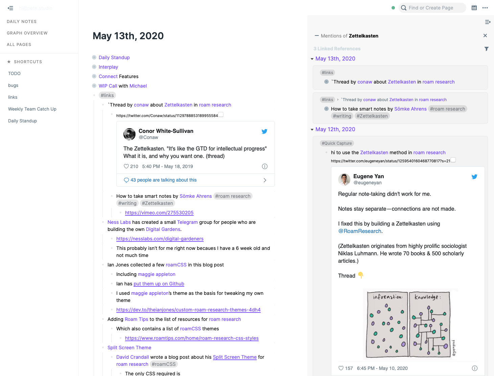

# Roam Research Themes
McReaper is a custom CSS Theme for [Roam Research](http://roamresearch.com). 

It's based off [mappletons](https://github.com/theianjones/roam-research-themes/blob/master/mappletons.css) by [Maggie Appleton](https://twitter.com/mappletons?lang=en). 

I've added CSS variables which you'll find at the top of the stylesheet — for example, you can change all of the link colours by changing the primary colour variable.

It uses [Inter](https://rsms.me/inter/) by which is a free typeface designed by [Rasmus Anderson](https://twitter.com/rsms)

